# Time & Space Complexity Analysis

**Topic 1.1 | Phase 1: Fundamentals**  
**Estimated Time:** 6-8 hours  
**Difficulty:** Fundamental

---

## 1. Overview

### What You'll Learn

In this lesson, you'll master the fundamental skill of analyzing algorithm efficiency. You'll learn how to:
- Measure and compare algorithm performance
- Use Big O, Omega, and Theta notations
- Analyze both time and space complexity
- Recognize common complexity patterns
- Make informed decisions about algorithm selection

### Why This Matters

Time and space complexity analysis is **the foundation of all DSA work**. Before you can understand why one algorithm is better than another, you need to know how to measure "better." This skill is:

- **Essential for interviews** - Almost every coding interview problem requires complexity analysis
- **Critical for optimization** - You can't improve what you can't measure
- **Key to problem-solving** - Helps you choose the right approach before coding
- **Fundamental to everything** - Every subsequent topic builds on this understanding

**Real-World Impact:** The difference between O(n) and O(n²) can mean the difference between an app that responds instantly and one that freezes for minutes. At scale (millions of users), these differences become business-critical.

---

## 2. Prerequisites

✅ **Basic JavaScript programming** (variables, functions, loops)  
✅ **Understanding of arrays** (you mentioned you have this)  
✅ **Basic mathematics** (algebra, logarithms at a high level)

---

## 3. Theory & Concepts

### What is Algorithm Complexity?

**Complexity** is a way to measure how an algorithm's resource usage (time or memory) grows as the input size increases.

Think of it like this: Imagine you're a chef preparing meals.
- If you're cooking for 2 people vs 20 people, how much longer does it take?
- If doubling the guests doubles your cooking time, that's **linear growth**
- If doubling the guests quadruples your cooking time, that's **quadratic growth**

We use the same thinking for algorithms: How does runtime/memory grow as input size grows?

### Why Not Just Measure Actual Time?

You might wonder: "Why not just time the algorithm with a stopwatch?"

**Problems with actual timing:**
1. **Hardware dependent** - Runs differently on different computers
2. **Language dependent** - JavaScript vs C++ vs Python have different speeds
3. **Input dependent** - Same algorithm might run differently on different inputs
4. **Environment dependent** - Other programs running affect timing

**Solution:** We analyze the **number of operations** relative to input size, independent of hardware/language.

### Input Size: The Variable n

In complexity analysis, we use **n** to represent the size of the input:
- For an array: n = number of elements
- For a string: n = length of string
- For a matrix: n = number of rows (or m × n for rows × columns)
- For a tree: n = number of nodes
- For a graph: n = number of vertices (sometimes V), m or E = number of edges

### Asymptotic Analysis

We care about **how algorithms behave as n gets very large** (approaches infinity). This is called **asymptotic analysis**.

Why focus on large n?
- Small inputs usually run fast anyway
- Real-world problems often have large inputs
- Patterns emerge at scale
- Reveals true algorithm behavior

### The Three Notations

#### Big O (O) - Upper Bound (Worst Case)

**Definition:** O(f(n)) means the algorithm will take **at most** f(n) operations.

**Think of it as:** The worst-case scenario. The "promise" that your algorithm won't be slower than this.

**Example:** Finding an element in an unsorted array
- Best case: Found in first position = O(1)
- Worst case: Not found, checked all n elements = O(n)
- **We say: O(n)** because that's the upper bound

**Why it's most common:** In practice, we care most about guarantees. Knowing the worst case helps us plan for it.

#### Big Omega (Ω) - Lower Bound (Best Case)

**Definition:** Ω(f(n)) means the algorithm will take **at least** f(n) operations.

**Think of it as:** The best-case scenario. The minimum time no matter how lucky we get.

**Example:** Finding an element in an unsorted array
- Best case: Found in first position = Ω(1)
- **We say: Ω(1)** because that's the lower bound

#### Big Theta (Θ) - Tight Bound (Average Case)

**Definition:** Θ(f(n)) means the algorithm takes **exactly** f(n) operations (both upper and lower bound).

**Think of it as:** When best case and worst case are the same.

**Example:** Printing all elements of an array
- Must visit all n elements no matter what
- **We say: Θ(n)** because it's always n operations

### Visual Understanding

```
Operations
    |
    |     /  <- O(n) - Never goes above this line
    |    /
    |   /
    |  /    <- Θ(n) - Always on this line
    | /
    |/___   <- Ω(n) - Never goes below this line
    +----------> Input Size (n)
```

### Common Time Complexities (Slowest to Fastest)

Let's see how different complexities behave with various input sizes:

| Complexity | n=10 | n=100 | n=1000 | Name | Example |
|------------|------|-------|--------|------|---------|
| **O(1)** | 1 | 1 | 1 | Constant | Array access by index |
| **O(log n)** | 3 | 7 | 10 | Logarithmic | Binary search |
| **O(n)** | 10 | 100 | 1000 | Linear | Linear search |
| **O(n log n)** | 30 | 700 | 10,000 | Linearithmic | Merge sort |
| **O(n²)** | 100 | 10,000 | 1,000,000 | Quadratic | Bubble sort |
| **O(n³)** | 1000 | 1,000,000 | 1,000,000,000 | Cubic | 3 nested loops |
| **O(2ⁿ)** | 1024 | 1.27×10³⁰ | 1.07×10³⁰¹ | Exponential | Fibonacci (naive) |
| **O(n!)** | 3,628,800 | 9.3×10¹⁵⁷ | ∞ | Factorial | Generate all permutations |

**Key Insight:** Notice the MASSIVE difference as n grows! At n=100:
- O(n) = 100 operations
- O(n²) = 10,000 operations (100x slower!)
- O(2ⁿ) = 1.27×10³⁰ operations (universe-lifetime slower!)

### Logarithms Refresher

**What is log₂(n)?**  
It's the number of times you can divide n by 2 until you reach 1.

Examples:
- log₂(8) = 3 because 8 → 4 → 2 → 1 (3 divisions)
- log₂(1000) ≈ 10 because 1000 → 500 → 250 → ... → 1 (about 10 divisions)

**Why logarithms appear in algorithms:**  
Any time you repeatedly divide the problem in half (like binary search), you get O(log n).

**Key properties:**
- log(n) grows very slowly
- log(1,000,000) ≈ 20 (tiny!)
- log(n) is the "opposite" of exponential growth

---

## 4. Visual Diagrams

### Growth Rate Comparison

```
Operations (y-axis)
    |
10K |                                              2^n
    |                                            /
    |                                          /
 8K |                                        /
    |                                      /
    |                                    /
 6K |                                  /
    |                                /         n^2
    |                              /         /
 4K |                            /         /
    |                          /         /
    |                        /         /
 2K |                      /         /
    |                    /         /
    |                  /         /
    |                /    n log n
    |              /    /
    |            /    /
    |          /    /____n
    |        /    /
    |      /____/________log n
    |____/________________1 (constant)
    +--------------------------------> Input Size (n)
     0   10   20   30   40   50
```

### Big O Hierarchy (Fastest to Slowest)

```
FASTER (Better)
    ↑
    |
O(1)         Constant     - Best possible
O(log n)     Logarithmic  - Excellent (e.g., binary search)
O(n)         Linear       - Good (unavoidable for reading all data)
O(n log n)   Linearithmic - Acceptable (best comparison sorts)
O(n²)        Quadratic    - Caution! Bad for large n
O(n³)        Cubic        - Usually bad
O(2ⁿ)        Exponential  - Very bad (only for small n)
O(n!)        Factorial    - Extremely bad (only tiny n)
    |
    ↓
SLOWER (Worse)
```

### Decision Tree for Complexity Analysis

```mermaid
graph TD
    Start[Start Analysis] --> SingleOp{Single operation?}
    SingleOp -->|Yes| O1[O1]
    SingleOp -->|No| Loop{Loop present?}
    Loop -->|No| Recursive{Recursive?}
    Loop -->|Yes| LoopType{Loop type?}
    LoopType -->|1 to n| Linear{Linear loop}
    Linear --> Nested{Nested loops?}
    Nested -->|No| On[On]
    Nested -->|Yes| CountNested{How many nested?}
    CountNested -->|2 levels| On2[On²]
    CountNested -->|3 levels| On3[On³]
    LoopType -->|Divide by 2| Ologn[Olog n]
    Recursive -->|Yes| RecType{Recursion type?}
    RecType -->|Divide problem in half| Ologn2[Olog n or On log n]
    RecType -->|Two recursive calls| O2n[O2ⁿ]
```



---

## 5. JavaScript Implementation

### Example 1: O(1) - Constant Time

```javascript
/**
 * Access element by index - O(1)
 * No matter how large the array, accessing by index takes same time
 */
function getElement(arr, index) {
    return arr[index];  // Single operation
}

// Always 1 operation, regardless of array size
console.log(getElement([1, 2, 3, 4, 5], 2));  // 3
console.log(getElement(Array(1000000).fill(0), 500000));  // Still instant!
```

### Example 2: O(log n) - Logarithmic Time

```javascript
/**
 * Binary Search - O(log n)
 * Divides search space in half each iteration
 */
function binarySearch(arr, target) {
    let left = 0;
    let right = arr.length - 1;
    
    while (left <= right) {
        const mid = Math.floor((left + right) / 2);
        
        if (arr[mid] === target) {
            return mid;  // Found!
        } else if (arr[mid] < target) {
            left = mid + 1;  // Search right half
        } else {
            right = mid - 1;  // Search left half
        }
    }
    
    return -1;  // Not found
}

// For array of 1000 elements: ~10 iterations max
// For array of 1,000,000 elements: ~20 iterations max
console.log(binarySearch([1, 3, 5, 7, 9, 11, 13], 7));  // 3
```

### Example 3: O(n) - Linear Time

```javascript
/**
 * Linear Search - O(n)
 * Might need to check every element
 */
function linearSearch(arr, target) {
    for (let i = 0; i < arr.length; i++) {  // Loop runs n times
        if (arr[i] === target) {
            return i;
        }
    }
    return -1;
}

/**
 * Sum all elements - O(n)
 * Must visit every element exactly once
 */
function sum(arr) {
    let total = 0;
    for (let num of arr) {  // Loop runs n times
        total += num;  // O(1) operation
    }
    return total;  // Total: n × O(1) = O(n)
}

console.log(sum([1, 2, 3, 4, 5]));  // 15
```

### Example 4: O(n log n) - Linearithmic Time

```javascript
/**
 * Merge Sort - O(n log n)
 * Divides array (log n levels) and merges (n work per level)
 */
function mergeSort(arr) {
    // Base case
    if (arr.length <= 1) return arr;
    
    // Divide: split array in half (creates log n levels)
    const mid = Math.floor(arr.length / 2);
    const left = mergeSort(arr.slice(0, mid));
    const right = mergeSort(arr.slice(mid));
    
    // Conquer: merge the sorted halves (n work)
    return merge(left, right);
}

function merge(left, right) {
    const result = [];
    let i = 0, j = 0;
    
    // Merge process: visits all n elements
    while (i < left.length && j < right.length) {
        if (left[i] < right[j]) {
            result.push(left[i++]);
        } else {
            result.push(right[j++]);
        }
    }
    
    return result.concat(left.slice(i)).concat(right.slice(j));
}

console.log(mergeSort([5, 2, 8, 1, 9]));  // [1, 2, 5, 8, 9]
```

### Example 5: O(n²) - Quadratic Time

```javascript
/**
 * Bubble Sort - O(n²)
 * Nested loops, each running n times
 */
function bubbleSort(arr) {
    const n = arr.length;
    
    // Outer loop: runs n times
    for (let i = 0; i < n; i++) {
        // Inner loop: runs n times for each outer iteration
        for (let j = 0; j < n - i - 1; j++) {
            if (arr[j] > arr[j + 1]) {
                // Swap
                [arr[j], arr[j + 1]] = [arr[j + 1], arr[j]];
            }
        }
    }
    
    return arr;
    // Total: n × n = n² comparisons
}

/**
 * Find duplicates (naive approach) - O(n²)
 * For each element, compare with all other elements
 */
function hasDuplicate(arr) {
    // Outer loop: n iterations
    for (let i = 0; i < arr.length; i++) {
        // Inner loop: n iterations
        for (let j = i + 1; j < arr.length; j++) {
            if (arr[i] === arr[j]) {
                return true;
            }
        }
    }
    return false;
    // Total: n × n = O(n²)
}

console.log(hasDuplicate([1, 2, 3, 4, 5]));  // false
console.log(hasDuplicate([1, 2, 3, 2, 5]));  // true
```

### Example 6: O(2ⁿ) - Exponential Time

```javascript
/**
 * Fibonacci (naive recursive) - O(2ⁿ)
 * Each call makes 2 more calls, creating exponential growth
 */
function fibonacci(n) {
    if (n <= 1) return n;
    
    // Two recursive calls per invocation!
    return fibonacci(n - 1) + fibonacci(n - 2);
}

// For fib(5): ~15 calls
// For fib(10): ~177 calls
// For fib(20): ~21,891 calls
// For fib(40): ~204,668,309 calls (takes seconds!)
console.log(fibonacci(10));  // 55

/**
 * Generate all subsets - O(2ⁿ)
 * n elements means 2ⁿ possible subsets
 */
function generateSubsets(arr) {
    const result = [];
    const n = arr.length;
    
    // 2ⁿ possible combinations
    for (let i = 0; i < (1 << n); i++) {  // 1 << n is 2ⁿ
        const subset = [];
        for (let j = 0; j < n; j++) {
            if (i & (1 << j)) {
                subset.push(arr[j]);
            }
        }
        result.push(subset);
    }
    
    return result;
}

console.log(generateSubsets([1, 2, 3]));
// [[], [1], [2], [1,2], [3], [1,3], [2,3], [1,2,3]]
```

### Space Complexity Examples

```javascript
/**
 * O(1) Space - Constant space
 * Only uses a fixed amount of extra memory
 */
function sumArray(arr) {
    let total = 0;  // Single variable
    for (let num of arr) {
        total += num;
    }
    return total;
    // Space: O(1) - only 'total' variable, regardless of input size
}

/**
 * O(n) Space - Linear space
 * Creates new array of same size as input
 */
function doubleArray(arr) {
    const result = [];  // New array of size n
    for (let num of arr) {
        result.push(num * 2);
    }
    return result;
    // Space: O(n) - result array grows with input
}

/**
 * O(n) Space - Recursive call stack
 * Each recursive call adds to call stack
 */
function factorial(n) {
    if (n <= 1) return 1;
    return n * factorial(n - 1);
    // Space: O(n) - n recursive calls on stack
}

/**
 * O(n²) Space - 2D array
 * Creates matrix of n×n elements
 */
function createMatrix(n) {
    const matrix = [];
    for (let i = 0; i < n; i++) {
        matrix[i] = new Array(n).fill(0);
    }
    return matrix;
    // Space: O(n²) - n×n elements stored
}
```

---

## 6. Step-by-Step Walkthrough

### How to Analyze Any Algorithm

**Step 1: Identify the input size (n)**
- What is growing? Array length? String length? Number value?

**Step 2: Count operations as a function of n**
- How many times do loops run?
- How many recursive calls?
- How many operations per iteration?

**Step 3: Express in terms of n**
- Write out the mathematical formula

**Step 4: Simplify to Big O**
- Drop constants
- Drop lower-order terms
- Keep only the fastest-growing term

### Detailed Example: Analyzing Nested Loops

```javascript
function exampleFunction(arr) {
    const n = arr.length;
    let count = 0;
    
    // Loop 1: Runs n times
    for (let i = 0; i < n; i++) {
        count++;  // O(1) operation, happens n times
    }
    
    // Loop 2: Nested loops
    for (let i = 0; i < n; i++) {           // Outer: n times
        for (let j = 0; j < n; j++) {       // Inner: n times per outer
            count++;  // O(1) operation, happens n×n times
        }
    }
    
    // Loop 3: Runs 100 times (constant)
    for (let i = 0; i < 100; i++) {
        count++;  // O(1) operation, happens 100 times
    }
    
    return count;
}
```

**Analysis:**
- Loop 1: n operations
- Loop 2: n × n = n² operations
- Loop 3: 100 operations (constant)
- **Total: n + n² + 100**

**Simplification:**
- As n grows large, n² dominates
- n + n² + 100 ≈ n² for large n
- Drop constants and lower terms
- **Result: O(n²)**

### Example: Analyzing Recursive Code

```javascript
function recursiveExample(n) {
    if (n <= 1) return 1;          // Base case: O(1)
    
    return recursiveExample(n - 1) // Recursive call 1
         + recursiveExample(n - 1) // Recursive call 2
         + n;                      // O(1) operation
}
```

**Analysis:**
- Each call makes 2 recursive calls
- Forms a binary tree of calls
- Tree depth: n levels
- Total calls: 1 + 2 + 4 + 8 + ... + 2ⁿ⁻¹ = 2ⁿ - 1
- **Result: O(2ⁿ)**

---

## 7. Complexity Analysis

### Time Complexity: How Long?

**Common patterns and their complexities:**

| Pattern | Complexity | Example |
|---------|------------|---------|
| Single operation | O(1) | `arr[i]`, `obj.prop` |
| Single loop (1 to n) | O(n) | `for (let i = 0; i < n; i++)` |
| Two separate loops | O(n + m) or O(n) if same | Loop 1 + Loop 2 |
| Nested loops (2 levels) | O(n²) | `for (...) { for (...) }` |
| Nested loops (3 levels) | O(n³) | Three nested loops |
| Divide by 2 each time | O(log n) | Binary search |
| Divide then process all | O(n log n) | Merge sort |
| Two recursive branches | O(2ⁿ) | Fibonacci (naive) |
| Loop with recursion | O(n × 2ⁿ) | Complex recursive |

### Space Complexity: How Much Memory?

**What counts towards space complexity:**
1. ✅ Variables and data structures you create
2. ✅ Recursive call stack
3. ✅ Dynamic allocations (arrays, objects)
4. ❌ Input array (already exists, doesn't count)
5. ❌ Output array (expected, often doesn't count)

**Note:** Sometimes "auxiliary space" (extra space beyond input/output) is specified.

### Rules for Simplification

#### Rule 1: Drop Constants

```javascript
// This is O(2n + 5)
for (let i = 0; i < n; i++) { }  // n operations
for (let i = 0; i < n; i++) { }  // n operations
for (let i = 0; i < 5; i++) { }  // 5 operations

// Simplifies to: O(n)
// Why? For large n, 2n vs n doesn't matter (both linear)
```

#### Rule 2: Drop Lower-Order Terms

```javascript
// This is O(n² + n + 100)
for (let i = 0; i < n; i++) {        // n² from nested loop
    for (let j = 0; j < n; j++) { }
}
for (let i = 0; i < n; i++) { }      // + n from single loop

// Simplifies to: O(n²)
// Why? For large n, n² dwarfs n and constants
```

#### Rule 3: Different Inputs Use Different Variables

```javascript
function process(arr1, arr2) {
    // Loop through arr1: O(n)
    for (let item of arr1) { }
    
    // Loop through arr2: O(m)
    for (let item of arr2) { }
}

// This is O(n + m), NOT O(n)
// Two different inputs with potentially different sizes
```

#### Rule 4: Nested Means Multiply, Sequential Means Add

```javascript
// Sequential loops: ADD
for (let i = 0; i < n; i++) { }     // O(n)
for (let i = 0; i < m; i++) { }     // O(m)
// Total: O(n + m)

// Nested loops: MULTIPLY
for (let i = 0; i < n; i++) {       // O(n)
    for (let j = 0; j < m; j++) { } // × O(m)
}
// Total: O(n × m) or O(nm)
```

---

## 8. Common Patterns

### Pattern 1: Recognizing O(1) - Constant

**Indicators:**
- No loops, no recursion
- Simple arithmetic/logic operations
- Array access by index
- Hash map get/set

```javascript
// All O(1)
const val = arr[5];
const sum = a + b;
const prop = obj.key;
const first = arr[0];
```

### Pattern 2: Recognizing O(log n) - Logarithmic

**Indicators:**
- Dividing input in half repeatedly
- Binary search pattern
- Balanced tree operations

**Question to ask:** "Does each step cut the problem size in half?"

```javascript
// Binary search: O(log n)
while (left <= right) {
    mid = (left + right) / 2;
    // Problem size halves each iteration
}
```

### Pattern 3: Recognizing O(n) - Linear

**Indicators:**
- Single loop through data
- Visiting each element once
- Simple recursive countdown

**Question to ask:** "Do I process each element exactly once?"

```javascript
// O(n) patterns
for (let i = 0; i < n; i++) { }
for (let item of array) { }
array.forEach(item => { });
```

### Pattern 4: Recognizing O(n log n) - Linearithmic

**Indicators:**
- Divide and conquer algorithms
- Efficient sorting (merge sort, quick sort)
- Operations that divide (log n) but process all data (n) at each level

**Question to ask:** "Am I dividing repeatedly AND processing all elements?"

```javascript
// Merge sort: O(n log n)
// Divides: log n levels
// Merges: n work per level
// Total: n × log n
```

### Pattern 5: Recognizing O(n²) - Quadratic

**Indicators:**
- Two nested loops over same data
- Comparing all pairs
- Naive sorting algorithms

**Question to ask:** "Am I checking every element against every other element?"

```javascript
// O(n²) patterns
for (let i = 0; i < n; i++) {
    for (let j = 0; j < n; j++) {
        // n × n operations
    }
}
```

### Pattern 6: Recognizing O(2ⁿ) - Exponential

**Indicators:**
- Multiple recursive branches
- Generating all possibilities
- Naive Fibonacci

**Question to ask:** "Does each step create multiple recursive calls?"

```javascript
// O(2ⁿ) pattern
function recursiveDoubleCall(n) {
    if (n <= 0) return;
    recursiveDoubleCall(n - 1);  // Branch 1
    recursiveDoubleCall(n - 1);  // Branch 2
}
```

---

## 9. Practice Problems

### Easy Problems

1. **Time Complexity Analysis**
   - LeetCode #1: Two Sum
   - Analyze: What's the time complexity of nested loop solution vs hash map solution?
   - Goal: Understand O(n²) vs O(n)

2. **Space Complexity Analysis**
   - LeetCode #283: Move Zeroes
   - Analyze: Can you solve in O(1) space?
   - Goal: Understand in-place vs extra space

3. **Simple Complexity Comparison**
   - LeetCode #344: Reverse String
   - Analyze: What's the time and space complexity?
   - Goal: Analyze simple algorithms

4. **Identifying Patterns**
   - LeetCode #217: Contains Duplicate
   - Analyze: Compare brute force vs hash set approach
   - Goal: Recognize when to use hash structures

5. **Loop Analysis**
   - LeetCode #350: Intersection of Two Arrays II
   - Analyze: Different approaches and their complexities
   - Goal: Practice analyzing multiple solutions

### Medium Problems

1. **Logarithmic Complexity**
   - LeetCode #33: Search in Rotated Sorted Array
   - Analyze: Why is modified binary search still O(log n)?
   - Goal: Master log n analysis

2. **Sorting Analysis**
   - LeetCode #75: Sort Colors
   - Analyze: O(n log n) vs O(n) solutions
   - Goal: Understand when you can beat comparison sort bounds

3. **Space-Time Tradeoff**
   - LeetCode #560: Subarray Sum Equals K
   - Analyze: O(n²) time O(1) space vs O(n) time O(n) space
   - Goal: Understand tradeoffs

4. **Recursion Complexity**
   - LeetCode #70: Climbing Stairs
   - Analyze: Recursive vs iterative vs DP approaches
   - Goal: Analyze recursive solutions

5. **Two Pointer Analysis**
   - LeetCode #15: 3Sum
   - Analyze: Why is this O(n²) and not O(n³)?
   - Goal: Analyze optimization techniques

### Hard Problems

1. **Complex Analysis**
   - LeetCode #4: Median of Two Sorted Arrays
   - Analyze: Why O(log(min(m,n)))?
   - Goal: Master complex algorithmic analysis

2. **Amortized Analysis**
   - LeetCode #155: Min Stack
   - Analyze: Amortized O(1) for all operations
   - Goal: Understand amortized complexity

3. **Divide and Conquer**
   - LeetCode #23: Merge K Sorted Lists
   - Analyze: Different approaches from O(kn) to O(n log k)
   - Goal: Optimize using better data structures

4. **Dynamic Programming**
   - LeetCode #72: Edit Distance
   - Analyze: O(mn) time and space, then optimize space to O(n)
   - Goal: Analyze DP complexity

5. **Advanced Patterns**
   - LeetCode #295: Find Median from Data Stream
   - Analyze: Using two heaps for O(log n) insert, O(1) find median
   - Goal: Master advanced complexity analysis

---

## 10. Common Pitfalls

### Pitfall 1: Forgetting to Drop Constants

❌ **Wrong:** "This algorithm is O(2n), so it's different from O(n)"  
✅ **Right:** "Both O(2n) and O(n) simplify to O(n) - constants don't matter in Big O"

**Why it matters:** Focus on growth rate, not exact operation count.

### Pitfall 2: Confusing Best, Worst, and Average Case

❌ **Wrong:** "Binary search is O(1) because sometimes you find it immediately"  
✅ **Right:** "Binary search is O(log n) worst case, O(1) best case - we usually cite worst case"

**Why it matters:** Big O typically refers to worst case unless specified.

### Pitfall 3: Not Accounting for Hidden Complexity

❌ **Wrong:** 
```javascript
for (let i = 0; i < n; i++) {
    arr.sort();  // "This is O(n) because one loop"
}
```

✅ **Right:** "This is O(n² log n) because sort is O(n log n) inside an O(n) loop"

**Why it matters:** Built-in operations have their own complexity!

### Pitfall 4: Confusing Space Complexity

❌ **Wrong:** "This function has O(n) space because it takes an array of size n"  
✅ **Right:** "Input doesn't count toward space complexity - only *extra* space you use"

**Why it matters:** Space complexity measures auxiliary space.

### Pitfall 5: Forgetting Recursion Call Stack

❌ **Wrong:** "This recursive function uses O(1) space - no extra arrays"  
✅ **Right:** "Recursion uses O(n) space for the call stack"

**Why it matters:** Call stack is real memory usage!

### Pitfall 6: Analyzing Average Case Without Proof

❌ **Wrong:** "Hash map is always O(1)"  
✅ **Right:** "Hash map is O(1) average case, O(n) worst case (collisions)"

**Why it matters:** Worst case can happen, be aware of it.

---

## 11. Interview Tips

### What Interviewers Look For

1. **Always state complexity** after solving a problem
   - "This solution runs in O(n) time and O(1) space"
   
2. **Explain your reasoning**
   - "It's O(n) because we visit each element once in the single loop"

3. **Discuss tradeoffs**
   - "We could use O(1) space but that increases time to O(n²)"

4. **Know when to optimize**
   - If asked "Can you do better?", look for optimization opportunities

5. **Recognize impossible optimizations**
   - "We must check all elements, so we can't do better than O(n)"

### Common Interview Questions

**"What's the time complexity?"**
- State Big O notation
- Explain briefly why
- Mention best/worst case if relevant

**"Can you optimize this?"**
- Look for:
  - Nested loops → Can one be removed?
  - Sorting → Is sorting necessary?
  - Repeated work → Can we cache/memoize?
  - Brute force → Is there a mathematical insight?

**"What's the space complexity?"**
- Count extra structures
- Mention recursion stack if applicable
- Discuss if it's necessary or can be reduced

### Red Flags to Avoid

❌ "I don't know the complexity"  
❌ "It's pretty fast"  
❌ "Maybe O(n) or O(n²), I'm not sure"  
❌ Stating wrong complexity with confidence  

✅ Walk through the code logically  
✅ Count loops and operations  
✅ Be precise and confident  

---

## 12. Summary & Key Takeaways

### Essential Concepts

1. **Big O measures growth rate** - How performance scales with input size
2. **Focus on worst case** - Big O typically means upper bound
3. **Drop constants and lower terms** - O(2n + 5) → O(n), O(n² + n) → O(n²)
4. **Common complexities** (fast to slow): O(1), O(log n), O(n), O(n log n), O(n²), O(2ⁿ), O(n!)
5. **Space complexity matters too** - Consider both time and space

### Quick Reference Card

```
O(1)      - Array access, hash map get/set, arithmetic
O(log n)  - Binary search, balanced tree operations
O(n)      - Linear search, single loop, array traversal
O(n log n)- Efficient sorting (merge sort, quick sort)
O(n²)     - Nested loops, bubble sort, checking all pairs
O(2ⁿ)     - Recursive branches, generating subsets
O(n!)     - Generating permutations
```

### Mental Models

**Time Complexity:**
- "How many times do I touch the data?"
- Single loop = O(n)
- Nested loops = multiply complexities
- Divide in half = add log n

**Space Complexity:**
- "What extra structures do I create?"
- Variables = O(1)
- Array of size n = O(n)
- Recursion depth n = O(n)

### Success Criteria

You've mastered this topic when you can:
- ✅ Analyze any algorithm's time complexity
- ✅ Recognize common complexity patterns instantly
- ✅ Calculate space complexity including recursion
- ✅ Explain why one algorithm is better than another
- ✅ Make informed optimization decisions

---

## 13. Next Steps

### What's Next?

**Next Topic:** Arrays Advanced Concepts (Topic 1.2)

Now that you can analyze algorithm efficiency, you'll learn advanced array techniques that leverage this knowledge. You'll understand WHY certain array techniques are better than others based on their complexity.

### How to Practice

1. **Code and analyze** - Write code, then analyze its complexity
2. **Review solutions** - Look at LeetCode solutions and verify their complexity claims
3. **Compare approaches** - For each problem, consider multiple solutions and their tradeoffs
4. **Teach someone** - Explain Big O to a friend or in writing

### Resources for Deeper Learning

- **Book:** "Introduction to Algorithms" (CLRS) - Chapter 3
- **Online:** Big O Cheat Sheet (bigocheatsheet.com)
- **Practice:** Analyze every LeetCode problem you solve

---

## 🎉 Congratulations!

You've completed the most fundamental topic in DSA! Everything from here builds on this foundation. Take a moment to appreciate what you've learned - you can now speak the language that all software engineers use to discuss algorithm efficiency.

**When you're ready to move forward, tell your tutor:** "I'm ready for the next topic!"

---

**Questions? Confused about anything? Ask your tutor for:**
- More examples
- Different explanations
- Additional practice problems
- Clarification on specific concepts

Remember: Understanding complexity analysis is crucial. Don't move forward until you're confident!

